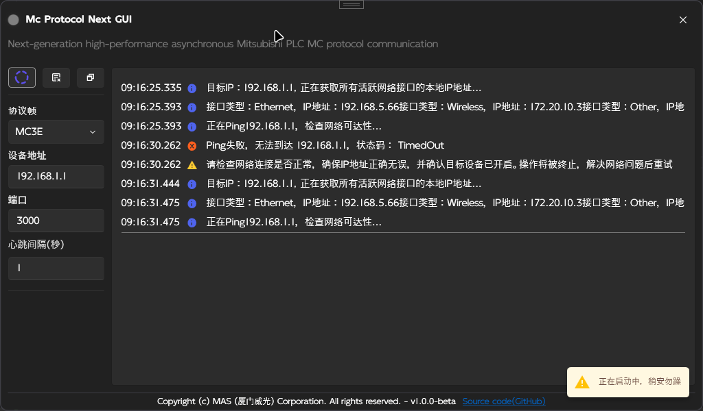

# WPF Demo for mc-protocol-next

下一代高性的能异步三菱 PLC MC 协议通信库

`mc-protocol-next` 是一个基于[McProtocol](https://github.com/SecondShiftEngineer/McProtocol)重构的现代化 MC 协议实现，为高性能三菱 PLC 通信设计。相比传统实现，提供：

- [x] 2倍性能提升 - 优化协议栈，减少延迟
- [x] 100% 异步支持 - 基于 asyncio 的高效通信
- [x] 结构化数据支持 - 直接读写 C# 结构体
- [x] 现代化架构 - 依赖注入、配置即服务
- [x] WPF - GUI 示例应用 - 开箱即用的应用程序

这个项目不仅是一个通信库，还附带一个 WPF 示例程序，展示如何在 Windows 环境下通过图形界面与 PLC 交互

## 📸 截图



## 💻 开发环境

- `IDE`： Visual Studio 2022
- `语言`： C#
- `UI框架`：  WPF (Windows Presentation Foundation)
- `操作系统`： Windows 7 SP1 或更高版本
- `.NET SDK`： .NET 8.0

## 🚀 快速开始

以下是搭建和使用`mc-protocol-next`的详细步骤，让你 10 分钟内跑起来！

### 项目配置

克隆项目后，打开解决方案文件（.sln）并确保安装了 .NET 8.0 SDK。WPF 示例项目已经配置好依赖，直接编译(McProtocolNextDemo)即可

### 服务注册

`mc-protocol-next`使用依赖注入（DI）管理服务，推荐在程序启动时注册核心服务

**扩展方法定义：**

```csharp
using McProtocolNext;
using Microsoft.Extensions.DependencyInjection;

namespace McProtocolNext;

public static class ServiceCollectionExtensions {
    /// <summary>
    /// 注册三菱 MC 协议通信服务
    /// </summary>
    public static IServiceCollection AddMcProtocolService(this IServiceCollection services) {
        return services.AddSingleton<IMcProtocol, McProtocol>();
    }
}
```

**在程序中注册：**

```csharp
var services = new ServiceCollection();
services.AddMcProtocolService();
var serviceProvider = services.BuildServiceProvider();
```

### 配置

你需要实现内置的配置接口，你也可以继承自`IMcCommunicationConfig`接口实现额外的配置项

**实现接口：**

```csharp
public class McProtocolConfig : IMcCommunicationConfig
```

**注入配置：**

```chsarp
_ = services.AddSingleton<IMcCommunicationConfig>(_ => AppConfig.McProtocols);
```

## 使用示例

### 结构体读写（推荐方式）

**结构体定义：**

[MitsubishiString] 是自定义特性，确保字符串以固定长度编码

```csharp
[StructLayout(LayoutKind.Sequential, Pack = 1)]
internal struct MixedDataStruct {
    public bool IsActive;           // 1 位 -> D3233.0
    public bool IsAlarm;            // 1 位 -> D3233.1
    public bool IsOperational;      // 1 位 -> D3233.2
    public bool IsError;            // 1 位 -> D3233.3
    public short Id;                // 2 字节 -> D3234, D3235
    public float Temperature;       // 4 字节 -> D3236 ~ D3239
    public double Pressure;         // 8 字节 -> D3240 ~ D3247
    public int Volume;              // 4 字节 -> D3248 ~ D3251
    [MitsubishiString(20)]
    public string DeviceName;       // 20 字节 -> D3252 ~ D3271
    [MitsubishiString(50)]
    public string ManufacturerName; // 50 字节 -> D3272 ~ D3321
}
```

**写入结构体：**

```csharp
private readonly IMcProtocol _mcProtocol;

var address = 3233;
MixedDataStruct writeData = new() {
    IsActive = true,
    IsAlarm = false,
    IsOperational = true,
    IsError = false,
    Id = 12345,
    Temperature = 25.5f,
    Pressure = 101.325,
    Volume = 500,
    DeviceName = "DeviceName-003",
    ManufacturerName = "ManufacturerName-XYZ"
};

// 从 D3233 开始写入
await _mcProtocol.WriteStructAsync(writeData, address).ConfigureAwait(false);
```

**读取结构体：**

```csharp
private readonly IMcProtocol _mcProtocol;

var address = 3233;

// 从 D3233 开始读取
var readResult = await _mcProtocol.ReadStructAsync(typeof(MixedDataStruct), address).ConfigureAwait(false);
// 或使用泛型
// var readResult = await _mcProtocol.ReadStructAsync<MixedDataStruct>(address).ConfigureAwait(false);
```
